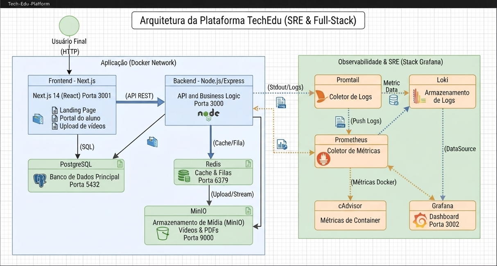

# TechEdu IA & Dev - Plataforma de Ensino com Observabilidade SRE

Plataforma de E-learning completa para cursos técnicos, certificações e livros PDF de tecnologia e IA. O projeto conta com Landing Page de vendas, carrinho de compras, painel administrativo para upload de mídias (Vídeos/PDFs) e portal do aluno com liberação de acesso baseada em pagamento (Mock). 

Além da aplicação full-stack, o projeto implementa uma stack completa de **Observabilidade SRE** (Métricas e Logs) open-source.

---

##  Arquitetura e Stack

A aplicação roda totalmente containerizada via Docker Compose, simulando um ambiente de microserviços local com 10 containers integrados.

### Diagrama de Arquitetura

Tecnologias Utilizadas
Frontend: Next.js 14 (React) - Porta 3001
Backend: Node.js3000
Banco de Dados: PostgreSQL 15 - Porta `5432
Cache & Filas: Redis 7 - Porta 6379
Armazenamento de Mídia: MinIO (S3 Compatible) - Portas 9000 (9001 (Console)
Métricas: Prometheus e9090 e 8080
Logs: Loki e Promtail - Porta 3100
Dashboard SRE: Grafana - Porta 3002

tech-edu-platform/
├── docker-compose.yml          # Orquestração de toda a infraestrutura
├── prometheus.yml              # Configuração de coleta de métricas
├── promtail-config.yml         # Configuração de coleta de logs
├── grafana/                    # Provisionamento automático do Grafana
│   └── provisioning/
│       └── datasources/
│           └── datasources.yml # Auto-configuração Prometheus e Loki
├── backend/
│   ├── Dockerfile
│   ├── package.json
│   └── src/
│       └── server.js          # API, regras de negócio e instrumentação SRE
└── frontend/
    ├── Dockerfile
    ├── package.json
    └── src/
        └── app/
            ├── layout.js       # Estrutura base do Next.js
            ├── page.js         # Landing Page (Home)
            ├── admin/
            │   └── page.js     # Painel Admin (Upload de vídeos)
            └── portal/
                └── page.js     # Portal do Aluno (Acesso às aulas)

                Como Rodar o Projeto (Guia de Instalação)
Subir a infraestrutura:
No terminal, na raiz do projeto, execute:
bash

docker-compose up --build -V -d
Configurar o MinIO (Apenas na primeira vez):
Para que os vídeos possam ser reproduzidos no navegador, a bucket deve ser pública. Rode:
bash

docker run --rm --net=host --entrypoint /bin/

docker run --rm --net=host --entrypoint /bin/sh minio/mc -c \
"mc alias set meu-minio http://localhost:9000 admin 12345678 && \
mc anonymous set download meu-minio/techedu"

Jornada do Usuário (Fluxo da Aplicação)
Cadastro: O usuário clica em "Criar Conta" na Landing Page. O Next.js envia um POST para a API, que salva o usuário no PostgreSQL.
Upload (Admin): O administrador acessa /admin, faz o upload de um vídeo. A API usa Multer + MinIO para salvar o arquivo físico e gera uma URL pública. Em seguida, salva os dados do curso (Título, Preço, URL) no banco.
Compra (Mock): O aluno acessa /portal, vê o curso disponível e clica em "Comprar Acesso". A API recebe o ID do usuário e do produto, inserindo na tabela user_products (simulando webhook de pagamento aprovado).
Liberação: O Frontend recarrega a lista de cursos do aluno. O produto comprado não exibe mais o botão de compra, e sim um player de vídeo (<video>) com o conteúdo do MinIO.

Observabilidade (SRE)
A stack de observabilidade é provisionada automaticamente. Não é necessário configurar manualmente o Grafana.

Acessando o Grafana
URL: http://localhost:3002
Login: admin | Senha: admin
O que monitorar:
Métricas (Prometheus): Vá no menu Explore -> Selecione Prometheus. Busque por http_requests_total para ver requisições na API, ou container_memory_usage_bytes para ver o consumo de RAM do WSL.
Logs (Loki): Vá no menu Explore -> Selecione Loki. Na caixa de pesquisa (LogQL), digite {container_name=~"techedu_.*"} e clique em Run query. Você verá os logs em tempo real de todos os containers da aplicação.
 Resolução de Problemas (Troubleshooting)
Durante o desenvolvimento, os seguintes desafios de infraestrutura foram resolvidos:

Erro: Cannot find module 'express' no Docker:
Causa: O volume do Docker sobrescrevia a pasta node_modules do container com a pasta vazia do host.
Solução: Adição de um volume anônimo (- /app/node_modules) no docker-compose.yml.
Erros 404 no Next.js:
Causa: Ausência do arquivo layout.js (exigência do App Router do Next 14) e da diretiva "use client" nas páginas interativas.
Solução: Criação do arquivo base e ajuste nas páginas React.
Falha ao reproduzir vídeos no navegador:
Causa: A bucket do MinIO estava como PRIVATE, bloqueando o acesso do navegador.
Solução: Configuração da política de acesso público via CLI do MinIO Client (mc anonymous set download).
Erro de Connection Refused no Grafana:
Causa: Uso de http://localhost:9090 nas configurações de Data Source.
Solução: Utilização do provisionamento automático apontando para o nome interno do serviço Docker (http://prometheus:9090 e http://loki:3100).
 Próximos Passos: Deploy para Kubernetes (K8s)
Para migração desta stack local para um cluster K8s (EKS, GKE, Minikube):

Registry: Enviar as imagens do backend e frontend para um repositório (DockerHub/ECR).
StatefulSets: Criar StatefulSets para Postgres e MinIO com PersistentVolumeClaims (PVC).
Ingress: Criar Services ClusterIP e um Ingress Controller para expor o Frontend e as APIs para a internet.
Secrets: Migrar as variáveis de ambiente do docker-compose.yml para arquivos K8s Secrets.

